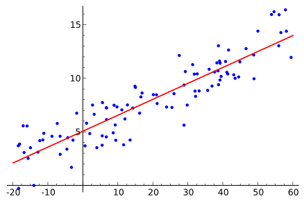

# Logistic Regression from Scratch

## Algorithm
According to Wikipedia, Logistic Regression is "estimating the parameters of a logistic model (a form of binary regression)". In logistic regression, the probability of a certain record belonging to a ceratin class is modeled. Logistic Regression is usually used to predict variables that have two possible outcomes like pass/fail, 0/1, win/lose. Each time, the Logistic Regression Classifier is trained to use values from a set of variables and calculate the probability of the predicted variable belonging to one of the classes. This can also be used in times where there are multiple classes possible for the predicting variable. In such situations, the model will calculate probabilies of each possible outcome over remaining outcomes. 

Linear Regression:

#### Training Dataset
Training dataset is input data which contains X values(the values which will be used for predictions or simply, features.) and y values(correct classifications).
In the code, m is used to represent the number of training examples.

#### The Model/Hypothesis
The part which takes features and their parameters(the trained values, outputs from enhancing the model performance) in order to predict values as probabilities of belonging to some specific class. The sigmoid function will be used for this hypothesis. It will take any value in and output values that are between 0 and 1. Thus, it is used for predicting probabilities. 
Basically, the classifier will:
- Predict y = 0 if hypothesis < 0.5
- Predict y = 1 if hypothesis => 0.5

Hypothesis function:

Sigmoid:

Sigmoid curve:

#### Cost Function
Shows the accuracy of hypothesis that are created by the model, using current set of trained/untrained parameters.

#### Gradient Descent
Gradient descent is an iterative optimization algorithm for finding the minimum of a cost function described above. To find a local minimum of a function using gradient descent, steps are taken that are proportional to the negative of the gradient (or approximate gradient) of the function at the current point.

## Files
- [accuracy.m](accuracy.m)- Function checking the accuracy of the trained model.
- [demo.m](demo.m) - Demo of Logistic Regression done with IRIS dataset.
- [gradient_callback.m](gradient_callback.m) - Function aggregating gradient step.
- [gradient_step](gradient_Step.m) - Function performing one step of the gradient descent.
- [hypothesis](hypothesis.m) - Function to calculate the hypothesis.
- [l_reg.m](l_reg.m) - Training the Logistic Regression model.
- [logreg_cost.m](logreg_cost.m) - Function to calculate the logistic regression cost
- [predict_l_reg.m](predict_l_reg) - Function that makes predictions using trained model.
- [radableCSV.py](readableCSV.py) - Python script to convert string values(IRIS Species) into numericals because *csvread* does not support string values to be read.
- [sigmoid.m](sigmoid.m) - The function that performs the sigmoid values.

## How to run

1. Clone the repository.
2. Go to the folder *data* and check whether there is a *readableIris.csv*. If there is not, run ` python readableCSV.py` and let it create the CSV file for you.
3. Make sure you have every file listed on the [files](##files) section.
4. Open Octave on your computer. Inside Octave, navigate to the folder you've cloned the repository to(the folder containing *demo.m* to be precise) using `cd` command.
5. Type `demo` on the command window of Octave.
6. Navigate through the demo according to the guidelines provided by the program.

## References

- [Machine Learning - Coursera (Andrew Ng)](https://www.coursera.org/learn/machine-learning)
- [Logistic Regression on trekhleb/machine-learning-octave](https://github.com/trekhleb/machine-learning-octave/tree/master/logistic-regression)
- [Logistic Regression on Wikipedia](https://en.wikipedia.org/wiki/Logistic_regression)
